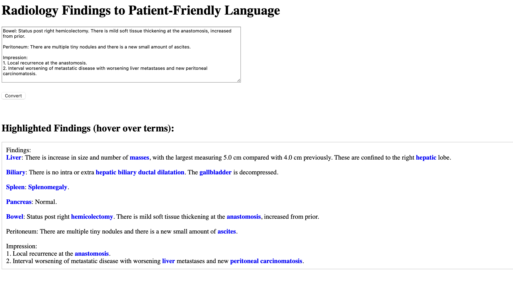
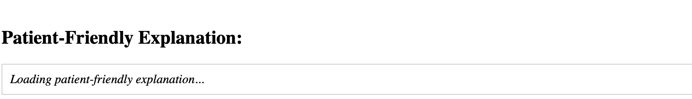
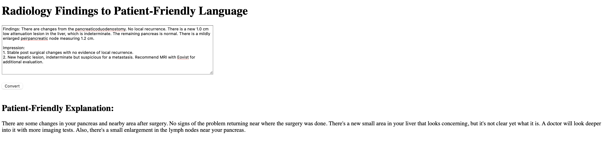

# Patient-Friendly Radiology Report Converter
# IDS 721 Spring 2025

This project provides a simple web application that rewrites radiology report findings into patient-friendly language using a locally hosted large language model (LLM). It also highlights common medical terms in the original text and displays their definitions as hover-over tooltips. The definitions are drawn from a custom-built dictionary tailored for this project, offering quick and accessible explanations for patients. 

Built with:
- **Rust** using the Actix-Web framework (backend + minimal frontend)
- **Mozilla's [llamafile]** (https://github.com/Mozilla-Ocho/llamafile) to serve a quantized model (e.g. DeepSeek 8B or Phi-2)
- **Docker & Docker Compose** for local orchestration
- **HTML & JS** frontend with inline display and term highlighting

---

## 🧬 LLM Architecture and EC2 Tradeoffs

### Model Selection
- **DeepSeek 8B** (quantized): Good performance and coherence; requires a larger instance (`g4dn.xlarge` or better).
- **Phi-2** (smaller, more efficient): Works on smaller machines but has lower-quality output in clinical contexts.
- **TinyLLaMA / Other LLMs**: Fast but overly generic summaries. Often too vague for diagnostic nuance.

### EC2 Considerations
| Model        | EC2 Type       | Pros                          | Cons                              |
|--------------|----------------|-------------------------------|-----------------------------------|
| DeepSeek 8B  | g4dn.xlarge+   | Quality summaries, good scale | Cost, startup time, GPU needed    |
| Phi-2        | t2.large+      | Fast setup, cheaper           | Generic output, less informative  |

**Takeaway:** Tradeoff between speed/cost and summary quality. A larger instance may be necessary for reliable clinical-grade rewriting.

---

## ✨ Project Structure
The tree structure is shown [here](tree.txt)

---
## 🌐 App Preview

### 📷 Screenshots
- 
- 
- 

### 🎬 Demo Video
- [Demo video link placeholder](https://your.video.url/here)

---

## 🚀 How to Run Locally

### 1. Clone and prepare the project

Make sure you have:

- Rust installed (`rustup`)
- Docker installed (`docker`, `docker-compose`)

Download and place the following into the `llamafile/` directory:
- The **llamafile** binary (download from GitHub releases)
- The **deepseek-8b.llamafile** model (download from Hugging Face)

---

### 2. Build and Start with Docker Compose

From the project root:

```bash
docker-compose build
docker-compose up
```

Rust Actix app will be available at: http://localhost:8000
Llamafile model server will run internally on port 8080 (not directly exposed)
✅ Paste radiology findings into the form.
✅ Get a patient-friendly explanation instantly.

🧠 How It Works

Frontend: Very simple HTML form served by Actix.
Backend: POSTs findings to the /explain endpoint.
Rust App: Formats a prompt, calls the Llamafile model via HTTP (http://llama:8080/completion).
Llamafile Server: Uses a open-source HuggingFace llamafile model (such as quantized DeepSeek 8B model) to generate patient-friendly text.

🛠 Updating the Model or App

🧪 Example Flow:
- User pastes report
- Highlighting runs immediately (local dictionary)
- POST to /explain sends formatted prompt to llamafile server
- LLM returns rewritten output
- Displayed in browser

⚡ Useful Commands


## 📦 Deployment Notes

This app has been deployed to:

AWS EC2 (with persistent EBS volumes)

On the EC2 instance, I have installed a .sh file (restart_all.sh), which stops other llamafile model and running docker containers with the app, and restarts the model and the app's docker container with the appropriate settings for the app to be able to access the model. An example is shown in the repository under restart_all.sh. 

## 📃 LLM Use Disclosure

Parts of this code and documentation were developed using GitHub Copilot and ChatGPT to assist with:

API design and error handling
Prompt engineering for clinical NLP
Documentation scaffolding
All clinical outputs should be reviewed by licensed professionals. This tool is intended for research and educational purposes only.

## Author

Built by [Chad Miller] - 2025